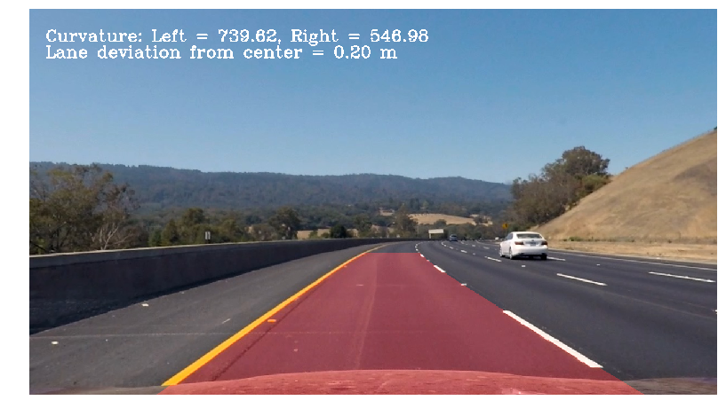

## Read Me

**Advanced Lane Finding Project**

The goals / steps of this project are the following:

* Computing  the camera calibration matrix and distortion coefficients through a set of chessboard images.
* Applying a distortion correction to raw images.
* Using color transforms, gradients, etc., to create a thresholded binary image.
* Applying a perspective transform to rectify binary image ("birds-eye view").
* Detecting lane pixels and fit to find the lane boundary.
* Determining the curvature of the lane and vehicle position with respect to center.
* Warping the detected lane boundaries back onto the original image.
* Dispaying Output visual display of the lane boundaries and numerical estimation of lane curvature and vehicle position.

# (Image References)
### Plotting Corners Step one Output
In this Step We took various angle of chessboard images and identified its corners using inbuild functions from cv2 library.For more details refer code.ipynb. 

### Correcting For Distortion
In this step Using above corners and finding image and object points we rectified images for distortion errors.For more detials refer to the code. 

### Undistorted and Wraped Image(Bird's Eye View)
In  this step we converted undistorted image into bird's eye view using persprective transform from cv2 library.For more details refer to the code.

### Applying Gradient And Threshold
In this we combined both sobelx  image output,taken by converting image into gray scale and taking sobelX characters, with 'S',taken HLS image transformation,to get proper line marks of the road.For more details refer to the code.  

### Visualising Lines On The bindary image
In this we calculated the points from binary wraped image and visualized image by drawing the lines on every wraped image.  

### Drawing Lane Lines
In this we Drawed Lines using polyfit polynomial function using histogram function to find out exact point where lines has to be drawn.This line was filled with lighter color using polyfill lines function.For more details refer to the code. 

###In Last Step the code was tested on video.
Following functions details the about video line drawn technique.
Line [class],correct_img()[function] ,procees()[function] and last moviepy editor,which was used to build video with detailing Text.

> Project Video results in project_results.mp4

#### Project Limitations

The above algorithm does not work well for the harder challenge video.This is because some adjustments are needed for algorithm to work properly.

